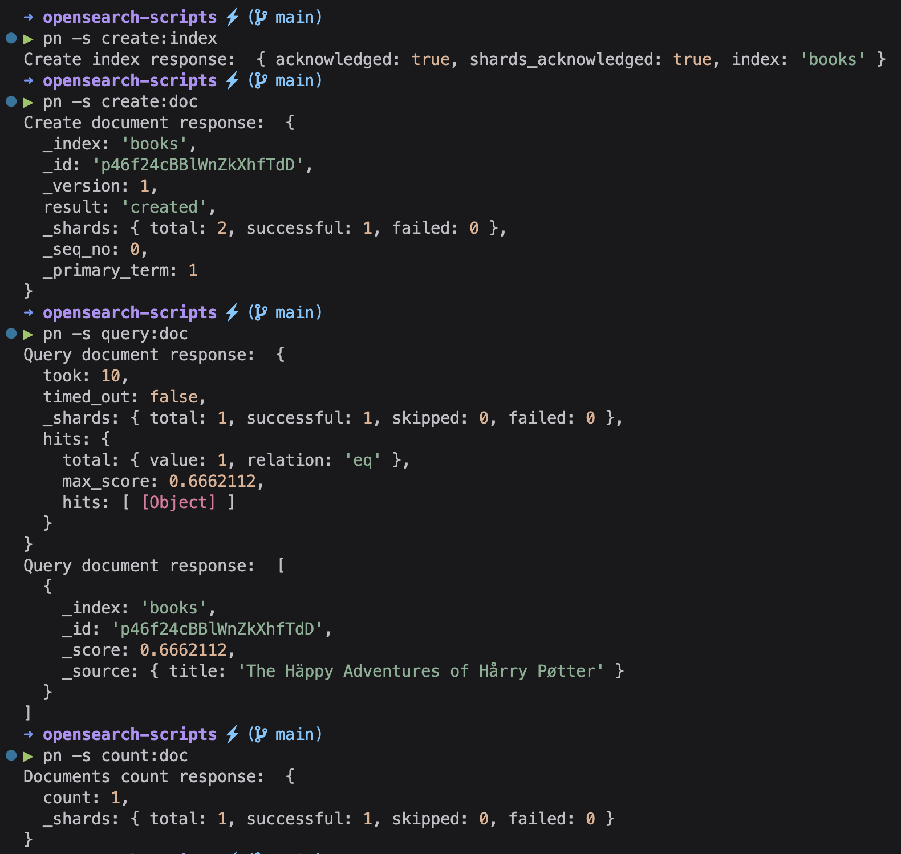

# Opensearch scripts

> Recently learned about the existance of the official [opensearch-cli](https://opensearch.org/docs/latest/tools/cli/)

> This repository evolved in my [os-cli](https://github.com/andreafspeziale/os-cli)

Fast and easy to use opensearch connection and operations scripts.

## Quickstart

- `cp ./env/.env.development .env`
- `cp ./src/config.example.ts ./src/config.ts`
- `docker compose up -d`

> Eventually reload the TS server

- `pnpm i`
- `pnpm create:index`
- `pnpm create:doc`
- `pnpm query:doc`

Check the available scripts in the `package.json` scripts section.

## Example



## Docker

The docker compose has been extracted and simplified from the [official documentation](https://opensearch.org/docs/latest/install-and-configure/install-opensearch/docker/#sample-docker-compose-file-for-development).

## Environment variables

- `OPENSEARCH_HOST`

Required: _true_ \
Description: your opensearch instance host.

- `CONNECTION_METHOD`

Required: _true_ \
Description: sets opensearch client accordingly. \
Values: [`local`, `proxy`, `serviceAccount`, `credentials`]

> `local` when using Docker locally or when using an `AwsSigv4` [proxy](https://github.com/awslabs/aws-sigv4-proxy)

- `AWS_REGION | AWS_DEFAULT_REGION`

Required: when _CONNECTION_METHOD_ is _serviceAccount_ or _credentials_ \
Description: the AWS region.

- `AWS_ROLE_ARN`

Required: when _CONNECTION_METHOD_ is _serviceAccount_ \
Description: the AWS role ARN injected by the serviceAccount.

- `AWS_WEB_IDENTITY_TOKEN_FILE`

Required: when _CONNECTION_METHOD_ is _serviceAccount_ \
Description: the AWS web identity toke file injected by the serviceAccount.

- `AWS_ACCESS_KEY_ID`

Required: when _CONNECTION_METHOD_ is _credentials_ \
Description: the AWS access key Id.

- `AWS_SECRET_ACCESS_KEY`

Required: when _CONNECTION_METHOD_ is _credentials_ \
Description: the AWS secret access key.

## Recipes

After seeding OpenSearch following the Quickstart you can try out the following recipes.

### Taking a Snapshot

- `pnpm run get:snapshot:repos` check if any snapshot repository has been ever created, it should be empty
- `pnpm run create:snapshot:repo` will create a repository named as configured (default: `snapshot-repository`)

You should now able to see something like this after checking out the first command again:

```
Get repositories response:  {
  'snapshot-repository': {
    type: 'fs',
    settings: {
      location: '/usr/share/opensearch/data/snapshots/snapshot-repository'
    }
  }
}
```

- `pnpm run create:snapshot` will creates your first snapshot
- `pnpm run get:snapshot:all` check all the snapshots for the created repository

The response should be something like this:

```
Get snapshots from repository response:  {
  snapshots: [
    {
      snapshot: 'snapshot-0',
      uuid: 'f5nBUxLSRfSJKDMB0AVm6Q',
      version_id: 136277827,
      version: '2.6.0',
      indices: [Array],
      data_streams: [],
      include_global_state: true,
      state: 'SUCCESS',
      start_time: '2023-06-23T10:50:22.579Z',
      start_time_in_millis: 1687517422579,
      end_time: '2023-06-23T10:50:22.579Z',
      end_time_in_millis: 1687517422579,
      duration_in_millis: 0,
      failures: [],
      shards: [Object]
    }
  ]
}
```

### Restoring a Snapshot withing same instance

Now let's DROP the index in order to restore it

- `pnpm run list:index` check the index list

The response should be something like this:

```
List index response:  [
  ...
  {
    health: 'green',
    status: 'open',
    index: 'books',
    uuid: 'NTiBDO4GSDCQDlg6CJyCPQ',
    pri: '1',
    rep: '1',
    'docs.count': '3',
    'docs.deleted': '1',
    'store.size': '8.1kb',
    'pri.store.size': '8.1kb'
  },
  ...
]
```

- `pnpm run delete:index` drop the index

The `books` index should be missing, you can check it out by running the first command again.

Now let's restore the dropped index

- `pnpm run restore:snapshot`

The `books` index should be restored, you can check it out by running the first command again.

Another common use-case could be the restore of the index after dropping just an index element (`pnpm run delete:doc`). In this case the index should be manually `closed` (`pnpm run close:index`) preventing it to be updated by any parallel process. After that you will able to restore it as showed above.
